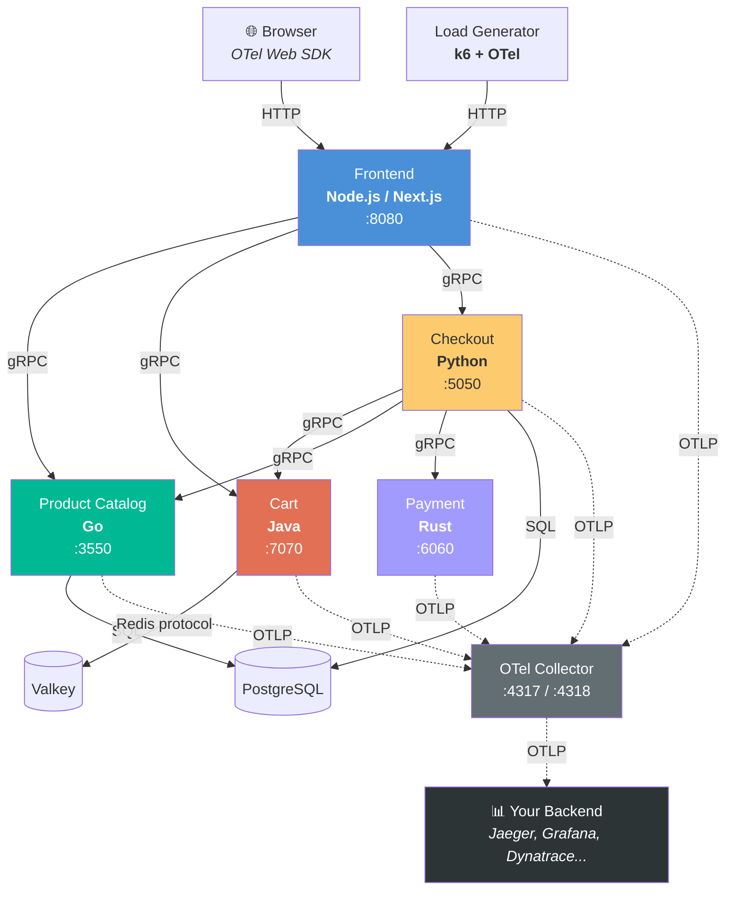
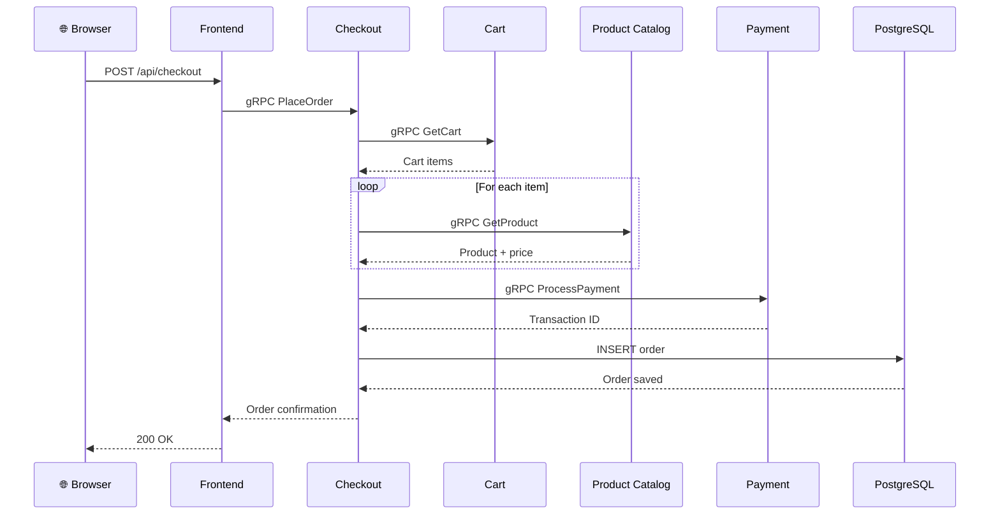
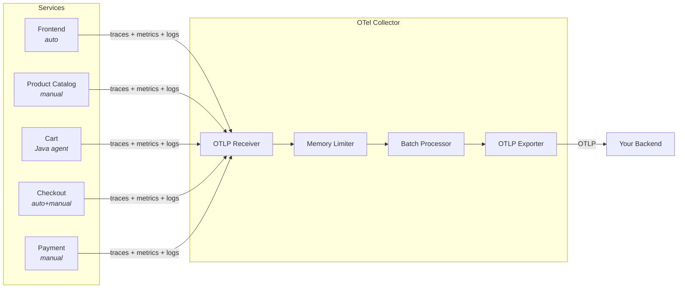

# OpenTelemetry Demo Light

A lightweight fork of the [opentelemetry-demo](https://github.com/open-telemetry/opentelemetry-demo): **5 microservices in 5 languages**, no bundled backends, runs in a GitHub Codespace under 1.5GB RAM.

## Architecture



### Checkout Flow

A single checkout request produces a distributed trace across all 5 services:



### Telemetry Pipeline



| Service | Language | Port | OTel Pattern |
|---------|----------|------|-------------|
| **Frontend** | Node.js (Next.js) | 8080 | Auto-instrumentation (`@opentelemetry/sdk-node`) |
| **Product Catalog** | Go | 3550 | Manual spans, custom attributes, baggage |
| **Cart** | Java | 7070 | Java Agent auto-instrumentation (zero code) |
| **Checkout** | Python | 5050 | Auto + Manual hybrid, structured logging |
| **Payment** | Rust | 6060 | Manual instrumentation (`opentelemetry-rust`) |

## Quickstart

```bash
# 1. Clone
git clone https://github.com/henrikrexed/opentelemetry-demo-light.git
cd opentelemetry-demo-light

# 2. Start
docker compose up -d

# 3. Open the storefront
open http://localhost:8080

# 4. View k6 load generator output
docker compose logs -f load-generator
```

Telemetry is exported to the **debug** exporter by default (visible in `docker compose logs otel-collector`).

## Bring Your Own Backend (BYOB)

### Option A: Local Jaeger (one command)

```bash
docker compose --profile jaeger up -d
# Jaeger UI at http://localhost:16686
```

### Option B: Grafana Cloud

```bash
cp .env.example .env
# Edit .env:
OTEL_EXPORTER_OTLP_ENDPOINT=https://otlp-gateway-prod-us-central-0.grafana.net/otlp
OTEL_EXPORTER_OTLP_HEADERS=Authorization=Basic <base64-encoded-instance-id:api-key>

docker compose up -d
```

### Option C: Dynatrace

```bash
cp .env.example .env
# Edit .env:
OTEL_EXPORTER_OTLP_ENDPOINT=https://{your-env-id}.live.dynatrace.com/api/v2/otlp
OTEL_EXPORTER_OTLP_HEADERS=Authorization=Api-Token <your-api-token>

docker compose up -d
```

### Option D: Generic OTLP Endpoint

```bash
cp .env.example .env
# Edit .env:
OTEL_EXPORTER_OTLP_ENDPOINT=https://your-backend:4317

docker compose up -d
```

Then uncomment the `otlp` exporter in `otel-collector-config.yaml` and add it to the pipeline exporters.

### Default: Debug Exporter

With no configuration, the collector uses the `debug` exporter. View telemetry in the console:

```bash
docker compose logs -f otel-collector
```

## OTel Features Demonstrated

1. **Auto-instrumentation** — Java agent (Cart), Python auto (Checkout), Node.js auto (Frontend)
2. **Manual instrumentation** — Go manual spans (Product Catalog), Rust manual spans (Payment)
3. **Context propagation** — W3C TraceContext across HTTP and gRPC, 5-service distributed trace
4. **Baggage propagation** — Metadata flowing across services (Product Catalog)
5. **Metrics** — RED metrics (auto) + custom business metrics (cart count, payment amount)
6. **Structured logs** — Trace-correlated logging with trace_id/span_id (Checkout)
7. **Database instrumentation** — PostgreSQL query spans
8. **Cache instrumentation** — Valkey/Redis spans from Java agent

## Resource Budget

| Component | Memory Limit |
|-----------|-------------|
| Frontend (Next.js) | 250 MB |
| Product Catalog (Go) | 20 MB |
| Cart (Java) | 200 MB |
| Checkout (Python) | 50 MB |
| Payment (Rust) | 10 MB |
| Load Generator (k6) | 128 MB |
| OTel Collector | 100 MB |
| PostgreSQL | 80 MB |
| Valkey | 20 MB |
| **Total** | **~858 MB** |

Fits comfortably in a 4-core / 8 GB GitHub Codespace.

## Kubernetes

```bash
kubectl apply -k kubernetes/
# Frontend at NodePort 30080
```

### Helm Chart

Install directly from OCI registry (no repo add needed):

```bash
helm install demo oci://ghcr.io/henrikrexed/charts/opentelemetry-demo-light --version 0.2.8

# BYOB mode (no collector, send directly to your backend)
helm install demo oci://ghcr.io/henrikrexed/charts/opentelemetry-demo-light --version 0.2.8 \
  --set collector.enabled=false \
  --set otlp.endpoint=https://your-backend:4317

# Delta metrics aggregation
helm install demo oci://ghcr.io/henrikrexed/charts/opentelemetry-demo-light --version 0.2.8 \
  --set metrics.aggregation=delta

# Expose via Gateway API (e.g. Istio)
helm install demo oci://ghcr.io/henrikrexed/charts/opentelemetry-demo-light --version 0.2.8 \
  --set gateway.enabled=true \
  --set gateway.provider=istio \
  --set gateway.hostname=demo.example.com
```

## Documentation

📖 **[Full Documentation](https://henrikrexed.github.io/opentelemetry-demo-light/)** — Architecture, getting started, per-service instrumentation guides


Full docs (architecture, getting started, per-service instrumentation guides): run locally with MkDocs:

```bash
pip install mkdocs-material
mkdocs serve
# Open http://localhost:8000
```

## Project Structure

```
proto/                    # Shared gRPC proto definitions
src/
  frontend/               # Node.js / Next.js (port 8080)
  product-catalog/        # Go (port 3550)
  cart/                   # Java (port 7070)
  checkout/               # Python (port 5050)
  payment/                # Rust (port 6060)
  load-generator/         # k6 with xk6-output-opentelemetry
  postgres/               # PostgreSQL init scripts
helm/                     # Helm chart
kubernetes/               # Kustomize manifests
docs/                     # MkDocs documentation
otel-collector-config.yaml
docker-compose.yaml
```

## Per-Service Documentation

Each service directory contains a README with OTel instrumentation patterns:

- [Frontend (Node.js)](src/frontend/README.md)
- [Product Catalog (Go)](src/product-catalog/README.md)
- [Cart (Java)](src/cart/README.md)
- [Checkout (Python)](src/checkout/README.md)
- [Payment (Rust)](src/payment/README.md)
