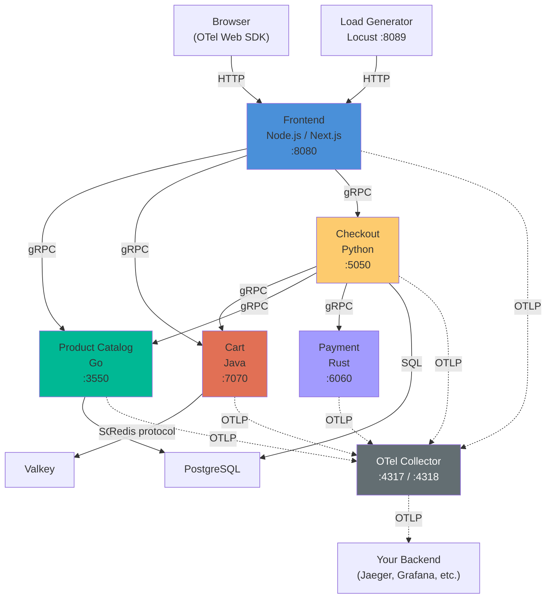
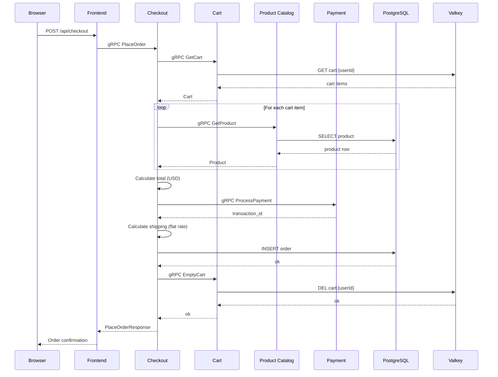
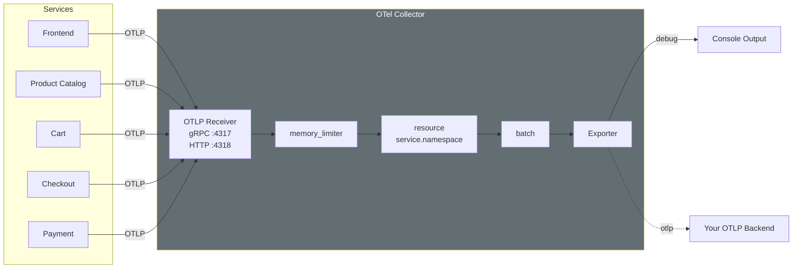
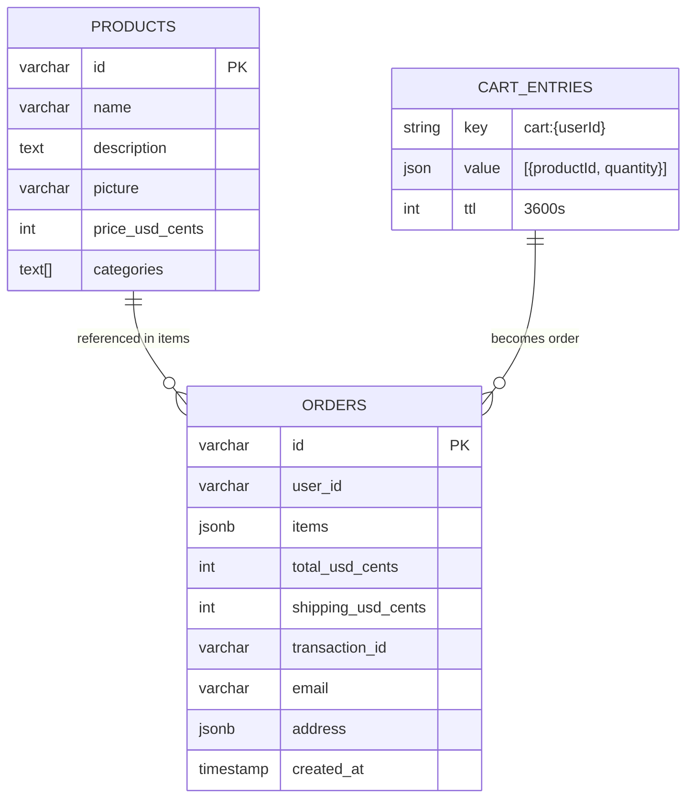

# Architecture

## Service Graph

## Checkout Request Flow

A single checkout request produces a distributed trace across all 5 services:

## OTel Telemetry Pipeline

## Data Architecture

## Resource Budget

Total steady-state memory: **~1,030 MB** (470 MB headroom to 1.5 GB limit).

| Component | Memory Limit | Notes |
|-----------|-------------|-------|
| Frontend | 250 MB | Next.js SSR + Node.js heap |
| Product Catalog | 20 MB | Static Go binary, in-memory cache |
| Cart | 200 MB | JVM + `-Xmx128m` heap |
| Checkout | 50 MB | Python interpreter + grpcio |
| Payment | 10 MB | Rust static binary |
| Load Generator | 300 MB | Locust + simulated user state |
| OTel Collector | 100 MB | Batch buffering + memory limiter |
| PostgreSQL | 80 MB | Shared buffers for 2 databases |
| Valkey | 20 MB | In-memory cache, small dataset |
