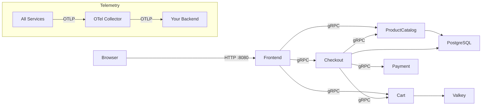

# OpenTelemetry Demo Light

**A lightweight fork of the official [opentelemetry-demo](https://github.com/open-telemetry/opentelemetry-demo).**

5 microservices. 5 languages. < 1.5 GB RAM. Runs in a GitHub Codespace.



## Why?

The official OTel demo requires **~5 GB RAM across 24 containers**. That won't run in a Codespace, a workshop laptop, or a quick learning session.

**OTel Demo Light** strips it down to what matters for learning OpenTelemetry:

| | Official Demo | Demo Light |
|---|---|---|
| Services | 12+ in 10+ languages | 5 in 5 languages |
| RAM | ~5 GB | ~1 GB |
| Containers | 24 | 9 |
| Backends | Jaeger, Grafana, Prometheus, OpenSearch | BYOB (Bring Your Own) |
| Kafka | Yes | No |

## Quick Start

```bash
git clone https://github.com/your-org/opentelemetry-demo-light.git
cd opentelemetry-demo-light
docker compose up -d
open http://localhost:8080
```

## Services at a Glance

| Service | Language | OTel Pattern | Port |
|---------|----------|-------------|------|
| [Frontend](services/frontend.md) | Node.js / Next.js | Auto-instrumentation | 8080 |
| [Product Catalog](services/product-catalog.md) | Go | Manual spans + baggage | 3550 |
| [Cart](services/cart.md) | Java | Java Agent (zero code) | 7070 |
| [Checkout](services/checkout.md) | Python | Auto + Manual hybrid | 5050 |
| [Payment](services/payment.md) | Rust | Manual instrumentation | 6060 |

