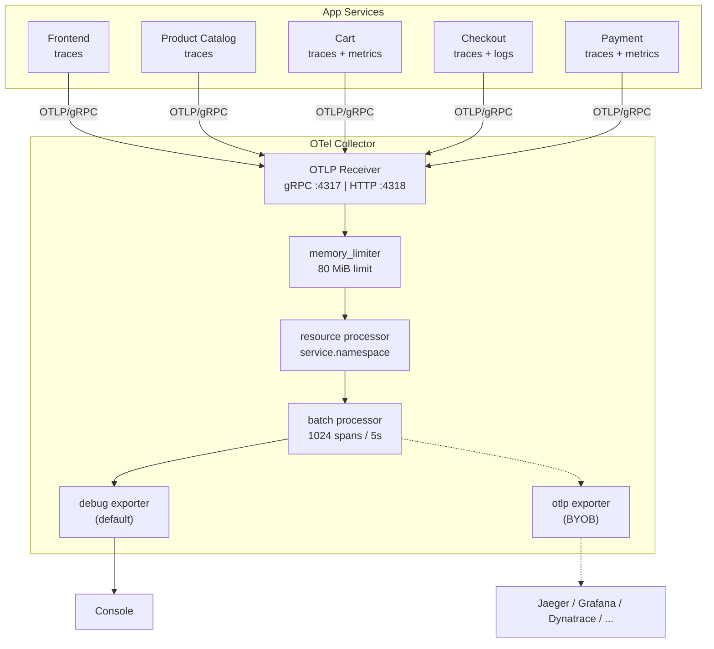
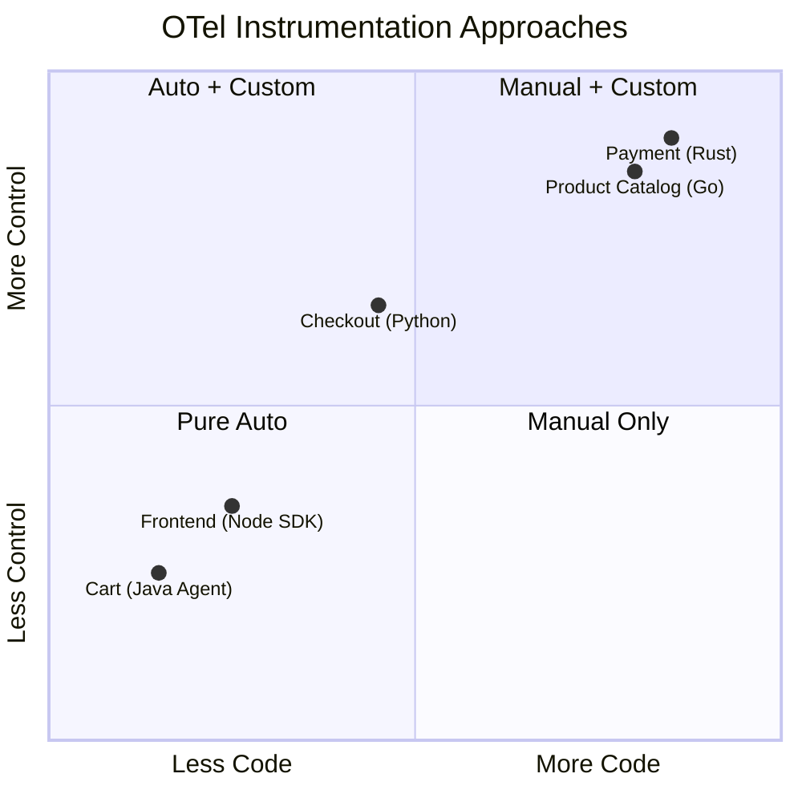

# Observability

How telemetry flows through the demo and what signals each service produces.

## Telemetry Pipeline



## Three Signal Types

### Traces

Every service produces distributed traces. A single checkout creates a trace spanning all 5 services:

```mermaid
gantt
    title Checkout Trace (simplified)
    dateFormat X
    axisFormat %s

    section Frontend
    HTTP POST /api/checkout      :0, 100

    section Checkout
    checkout.place_order         :5, 95
    checkout.calculate_total     :10, 30
    checkout.shipping_calc       :60, 65

    section Cart
    GetCart                      :8, 15
    EmptyCart                    :80, 85

    section Product Catalog
    GetProduct                   :12, 25

    section Payment
    payment.process              :35, 55
    payment.validate             :37, 40
    payment.charge               :42, 50
```



### Metrics

| Service | Metric | Type | Description |
|---------|--------|------|-------------|
| Cart | `app.cart.add.total` | Counter | Add-to-cart operations |
| Cart | `app.cart.items.count` | Gauge | Items in cart |
| Payment | `app.payment.processed.total` | Counter | Payments processed |
| Payment | `app.payment.amount.sum` | Counter | Total USD cents |
| All | `http.server.duration` | Histogram | HTTP request duration (auto) |
| All | `rpc.server.duration` | Histogram | gRPC request duration (auto) |

The `metrics.aggregation` Helm value controls temporality preference (`cumulative` or `delta`).

### Logs

The Checkout service demonstrates trace-correlated structured logging:

```json
{
  "timestamp": "2024-01-15T10:30:00Z",
  "level": "INFO",
  "logger": "checkout",
  "message": "Order placed: order_id=abc-123 total_cents=19998 items=2",
  "trace_id": "4bf92f3577b34da6a3ce929d0e0e4736",
  "span_id": "00f067aa0ba902b7"
}
```

Key log events from Checkout:

- `Payment processed: transaction_id=...`
- `Cart emptied for user ...`
- `Order placed: order_id=... total_cents=... items=...`

## Context Propagation

W3C TraceContext propagates across all boundaries:

| Boundary | Mechanism |
|----------|-----------|
| Browser -> Frontend | `traceparent` HTTP header |
| Frontend -> Backend | gRPC metadata |
| Checkout -> Cart / Catalog / Payment | gRPC metadata |
| Service -> PostgreSQL | OTel SDK injects into DB driver spans |
| Service -> Valkey | Java Agent injects into Redis client spans |

## OTel Instrumentation Patterns



| Pattern | Service | What You Learn |
|---------|---------|---------------|
| Pure auto | Cart (Java) | Zero-code instrumentation via agent |
| Auto + custom metrics | Cart (Java) | Adding business metrics alongside auto |
| Auto + manual spans | Checkout (Python) | Hybrid approach for business logic |
| Manual only | Product Catalog (Go) | Full control, explicit span lifecycle |
| Manual only | Payment (Rust) | Manual in a systems language |
