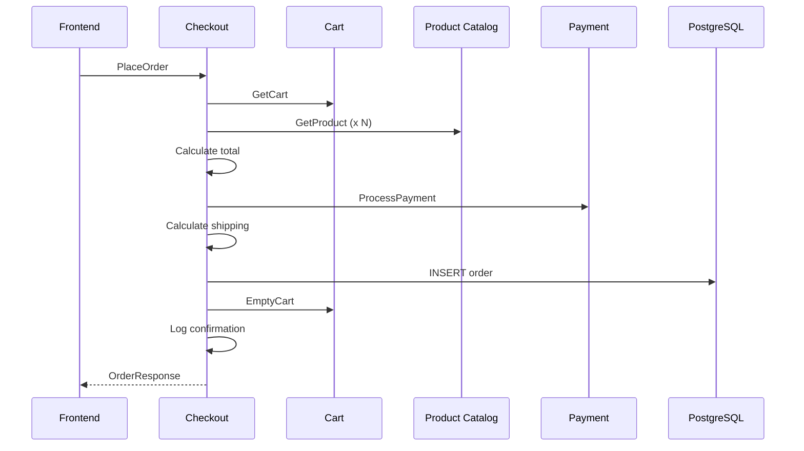

# Checkout (Python)

| | |
|---|---|
| **Language** | Python 3.12 |
| **Port** | 5050 (gRPC) |
| **OTel Strategy** | Auto + Manual hybrid |
| **Source** | `src/checkout/` |

## How It Works

The order orchestrator. On a `PlaceOrder` call, it coordinates Cart, Product Catalog, and Payment services, stores the order, and logs confirmation.



## OTel Instrumentation

### Auto (via `opentelemetry-instrument` wrapper)

- gRPC server/client spans
- PostgreSQL query spans (psycopg2)

### Manual Spans

| Span | Attributes |
|------|-----------|
| `checkout.place_order` | `app.order.id`, `app.order.total`, `app.order.items.count`, `app.payment.transaction_id` |
| `checkout.calculate_total` | `app.order.total`, `app.order.items.count` |
| `checkout.shipping_calc` | `app.shipping.cost_cents`, `app.shipping.item_count` |
| `checkout.send_confirmation` | `app.order.id` |

### Structured Logging

All log entries include `trace_id` and `span_id` for trace-log correlation:

```
2024-01-15 10:30:00 INFO [checkout] [trace_id=abc123 span_id=def456] Order placed: order_id=...
```

## Key Files

| File | What to Study |
|------|--------------|
| `checkout_service.py` | Orchestration flow, manual spans, structured logging |
| `Dockerfile` | `opentelemetry-instrument` entrypoint wrapper |
