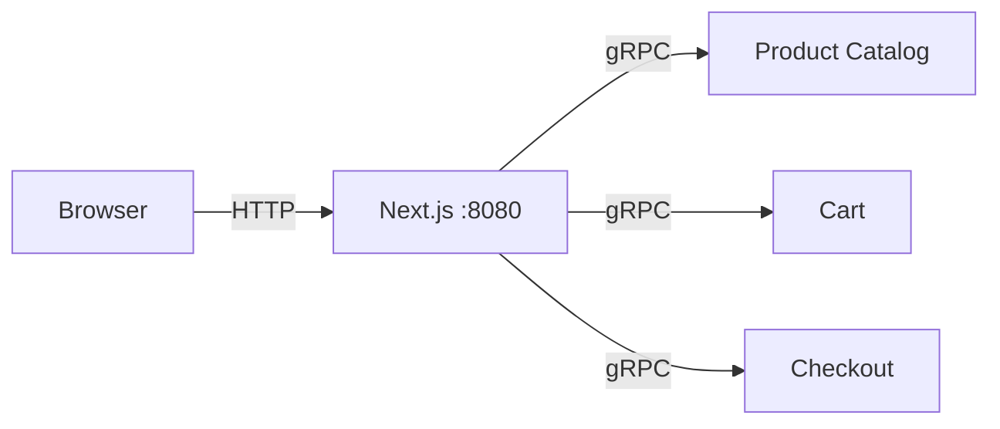

# Frontend (Node.js / Next.js)

| | |
|---|---|
| **Language** | Node.js 20, Next.js 14 (App Router) |
| **Port** | 8080 (HTTP -- serves directly, no proxy) |
| **OTel Strategy** | Server: auto-instrumentation via `@opentelemetry/sdk-node` |
| **Source** | `src/frontend/` |

## How It Works

The frontend is a Next.js application that serves HTTP directly on port 8080. It communicates with backend services via gRPC through API routes.

## OTel Instrumentation

### Server-Side (Auto)

`instrumentation.js` initializes `@opentelemetry/sdk-node` with `getNodeAutoInstrumentations()`. This auto-captures:

- HTTP server spans (every incoming request)
- gRPC client spans (calls to backend services)
- Next.js rendering spans

### Browser-Side

The Browser SDK generates page load, user interaction, and fetch spans with W3C TraceContext propagation.

## Spans Produced

| Span | Source | Description |
|------|--------|-------------|
| `GET /` | Auto (HTTP) | Homepage request |
| `GET /api/products` | Auto (HTTP) | Product listing API |
| `POST /api/checkout` | Auto (HTTP) | Checkout submission |
| `oteldemo.ProductCatalogService/ListProducts` | Auto (gRPC) | gRPC call to catalog |
| `oteldemo.CartService/AddItem` | Auto (gRPC) | gRPC call to cart |

## Key Files

| File | What to Study |
|------|--------------|
| `instrumentation.js` | OTel SDK setup, auto-instrumentation config |
| `lib/grpc-client.js` | gRPC client with dynamic proto loading |
| `app/api/*/route.js` | API routes proxying gRPC calls |
