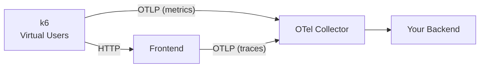
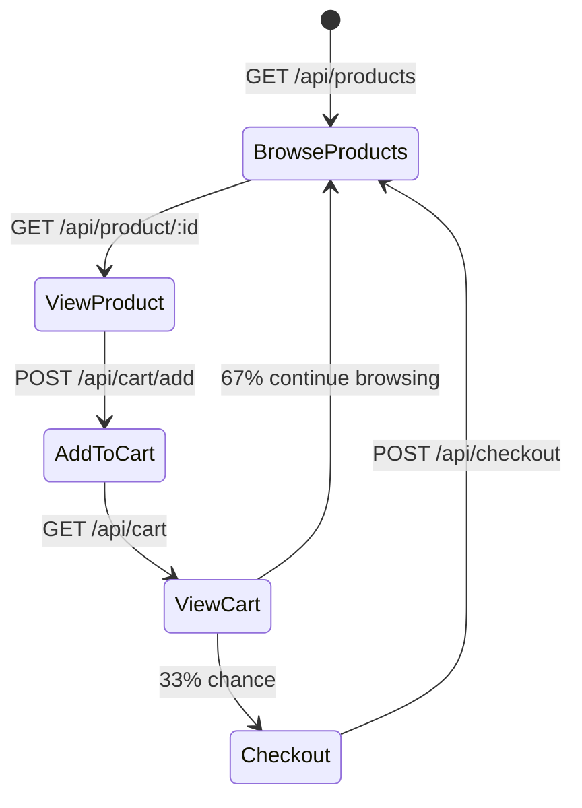

# Load Generator (k6 + xk6-output-opentelemetry)

| | |
|---|---|
| **Tool** | [k6](https://k6.io/) with [xk6-output-opentelemetry](https://github.com/grafana/xk6-output-opentelemetry) |
| **Language** | JavaScript (k6 runtime) |
| **OTel Integration** | Native OTLP export via `--out experimental-opentelemetry` |
| **Source** | `src/load-generator/` |

## Why k6?

k6 is a modern load testing tool with native OpenTelemetry integration via the `xk6-output-opentelemetry` extension. Unlike traditional load generators, k6 exports its own metrics (request duration, error rate, VU count) directly to the OTel Collector via OTLP — so load test metrics appear alongside application metrics in your observability backend.

## User Journey

Each virtual user (VU) runs this loop continuously:

This exercises all 5 application services and both datastores (PostgreSQL, Valkey).

## OTel Metrics Exported

k6 sends these metrics to the collector via OTLP/gRPC:

| Metric | Type | Description |
|--------|------|-------------|
| `k6_http_req_duration` | Histogram | HTTP request duration |
| `k6_http_req_failed` | Counter | Failed requests |
| `k6_http_reqs` | Counter | Total HTTP requests |
| `k6_vus` | Gauge | Active virtual users |
| `k6_iterations` | Counter | Completed test iterations |
| `k6_data_sent` | Counter | Bytes sent |
| `k6_data_received` | Counter | Bytes received |

## Configuration

| Environment Variable | Default | Description |
|---------------------|---------|-------------|
| `FRONTEND_URL` | `http://frontend:8080` | Target URL |
| `K6_VUS` | `5` | Virtual users (concurrency) |
| `K6_DURATION` | `0` (infinite) | Test duration (`30s`, `5m`, `0`=forever) |
| `K6_OTEL_EXPORTER_OTLP_ENDPOINT` | `http://otel-collector:4317` | OTLP endpoint |
| `K6_OTEL_GRPC_EXPORTER_INSECURE` | `true` | Use insecure gRPC |

## Key Files

| File | Purpose |
|------|---------|
| `test.js` | k6 test script — user journey simulation |
| `run.sh` | Entrypoint that runs k6 with `--out experimental-opentelemetry` |
| `Dockerfile` | Builds custom k6 binary with xk6-output-opentelemetry using `grafana/xk6` |
